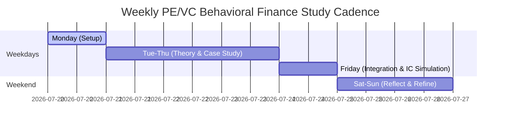

# The Intensive PE/VC Study Cadence
## IDEAL-WORKFLOW.md (~15-20 Hours/Week)

To succeed in this program, you must treat your study block like deal preparation. No cutting corners. This workflow divides your week into clear, high-yield operational blocks.

---

---

## 📅 Weekly Schedule Breakdown

### 🟢 Monday: Setup & Target Sourcing (2 Hours)
* **Goal:** Set targets and analyze past logs.
* **Tasks:**
  * Read the previous week's [learning-log.md](file:///C:/Users/HP/onedrive/desktop/behavioral-finance-duke-university/learning-log.md) and [deal-decision-journal.md](file:///C:/Users/HP/onedrive/desktop/behavioral-finance-duke-university/deal-decision-journal.md).
  * Update [session-state.md](file:///C:/Users/HP/onedrive/desktop/behavioral-finance-duke-university/session-state.md) with the goals for the current week's module.
  * Research and pull 1 real-world PE/VC deal case study (historical or active in the news) that maps to this week's theme.

### 🟡 Tuesday – Thursday: Deep Case Study & Theory (9 Hours total / 3 Hours daily)
* **Goal:** Master the academic models and map them to transaction structures.
* **Tasks:**
  * **Hour 1:** Complete Duke video lectures and transcripts for the module.
  * **Hour 2:** Dive into academic literature/supplementary readings (e.g., Prospect Theory, Thaler's Nudges, or market efficiency anomalies).
  * **Hour 3:** Work on the **Module's Applied Project** (e.g., building the DD framework or bidding playbook). Write findings to the module note-taking file.

### 🔴 Friday: Integration & IC Simulation (4 Hours)
* **Goal:** Undergo pressure testing and audit your decision-making.
* **Tasks:**
  * **Hour 1-2 (The Committee):** Run an AI-simulated Board Meeting or Investment Committee (using the prompt guides in [INDEX.md](file:///C:/Users/HP/onedrive/desktop/behavioral-finance-duke-university/INDEX.md)). Focus on defending your investment thesis against psychological skew.
  * **Hour 3 (Deal Audit):** Document the simulation results or an active deal evaluation in [deal-decision-journal.md](file:///C:/Users/HP/onedrive/desktop/behavioral-finance-duke-university/deal-decision-journal.md).
  * **Hour 4 (Repo Sync):** Clean up files, log new terms in [glossary.md](file:///C:/Users/HP/onedrive/desktop/behavioral-finance-duke-university/glossary.md), and commit changes to your Git repository.

### 🔵 Weekend: Reflect & Refine (2-3 Hours)
* **Goal:** Solidify memory and decompress.
* **Tasks:**
  * Review all terms added to [glossary.md](file:///C:/Users/HP/onedrive/desktop/behavioral-finance-duke-university/glossary.md).
  * Read a chapter of the recommended behavioral finance texts (e.g., *Nudge*, *Thinking, Fast and Slow*, or *The Behavior Gap*).

---

## 🔄 Daily Session Routine (Strict Protocol)

Before starting any study block, you must execute the **Session State Protocol**:

### 🏁 Start-of-Session Protocol
1. Open [session-state.md](file:///C:/Users/HP/onedrive/desktop/behavioral-finance-duke-university/session-state.md).
2. Read the current status, open questions, and next steps from the last session.
3. Write down:
   * Focus for the next 3 hours.
   * Key outputs you aim to produce.

### 🏁 End-of-Session Protocol
1. Document the actual progress made.
2. Note down key takeaways and points of confusion.
3. Log daily activities in [learning-log.md](file:///C:/Users/HP/onedrive/desktop/behavioral-finance-duke-university/learning-log.md).
4. Save and close.
