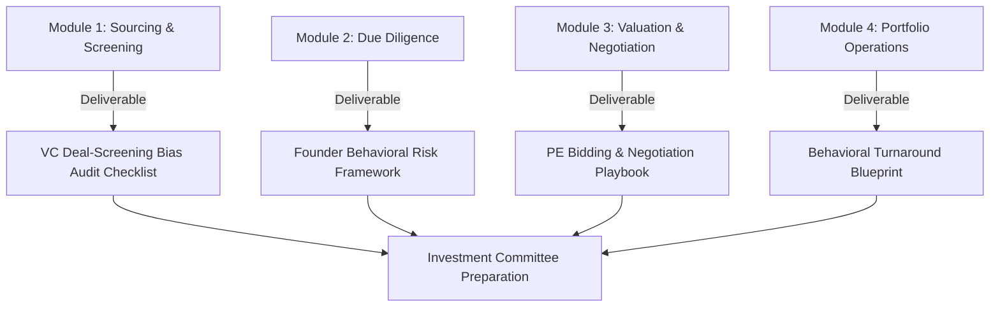

# Master Curriculum: Behavioral Finance in PE & VC
## Duke University Behavioral Finance Course (Custom PE/VC Track)

Welcome to the program. As a junior investment professional, your technical modeling (LBOs, DCFs, Cap Tables) is just the baseline. The real alpha in Private Equity and Venture Capital comes from understanding human psychology—both in the founders you back, the management teams you govern, and the investment committee (IC) you present to. 

This master index maps the academic foundations of the Duke Behavioral Finance syllabus to high-stakes PE/VC decision-making.

---

---

## 📅 The 4-Module Curriculum

### 🔹 Module 1: Sourcing & Screening: Narrative Fallacy, Similarity Bias, & FOMO
* **Duke Syllabus Link:** Week 1 (Traditional Utility vs. Real-World Behavioral Deviations).
* **PE/VC Context:** Sourcing deals, screening incoming pitches, and avoiding herd behavior (FOMO) when a hot deal is clearing the market.
* **Pre-Flight Study (Mastery Topics):**
  * Expected Utility Theory vs. Prospect Theory reference points in valuation.
  * The Narrative Fallacy: Evaluating business models based on storytelling rather than unit economics.
  * Similarity Bias: The tendency to back founders who look, speak, or went to school with the investors.
* **Applied PE/VC Milestone Project:**
  * **VC Deal-Screening Bias Audit Checklist:** A highly structured framework to audit a pitch deck and score the investment thesis, filtering out subjective biases like narrative attraction and sector FOMO.
* **AI Prompt Guide:**
  * *Disaster Story Explainer:* `"Explain [bias, e.g., Herd Behavior/FOMO] through the lens of a real-world VC/PE disaster story (such as Theranos or WeWork). Show how the investment committee ignored red flags because of this bias."`
  * *Grill My Sourcing Thesis:* `"I am pitching you a hot AI infrastructure startup at a $100M pre-revenue valuation. Grill my sourcing thesis. Act as a skeptical PE/VC Managing Director who believes I've fallen for the founder's charisma and sector FOMO."`

---

### 🔹 Module 2: Due Diligence: Overconfidence, Loss Aversion, & Groupthink
* **Duke Syllabus Link:** Week 2 (Heuristics, Biases, and Probability Distortion).
* **PE/VC Context:** Deep dive due diligence (DD) on financials, tech stacks, and management capabilities.
* **Pre-Flight Study (Mastery Topics):**
  * Overconfidence & The Planning Fallacy: Why management financial projections are structurally optimistic.
  * Probability Distortion: The tendency of deal teams to overestimate the upside (success probability) of early-stage technologies.
  * Groupthink in Investment Committees: How dominant partners drive consensus, silencing dissenting analysts.
* **Applied PE/VC Milestone Project:**
  * **Founder & Management Behavioral Risk Assessment Framework:** A qualitative DD scoring tool that uses executive interview questions to diagnose founder overconfidence, key-person risk, and cognitive rigidity.
* **AI Prompt Guide:**
  * *DD Blindspot Audit:* `"I am conducting due diligence on a mid-market manufacturing company. The founder has grown it for 20 years and is staying on. Help me identify behavioral blindspots, cognitive rigidity, and key-person risk using a diagnostic interview prompt."`
  * *IC Simulation:* `"Act as the Investment Committee (IC). I will present my investment memo. Challenge my assumptions, point out where I have adjusted my risk weights to match my bias, and grill my growth rates."`

---

### 🔹 Module 3: Valuation & Negotiation: Anchoring, Escalation of Commitment, & The Winner's Curse
* **Duke Syllabus Link:** Week 2 & 3 (Heuristics in Action and Financial Consequences).
* **PE/VC Context:** Pricing the deal, constructing terms sheets, and participating in competitive bidding processes.
* **Pre-Flight Study (Mastery Topics):**
  * Anchoring: How the seller’s initial asking price skew all subsequent valuation models.
  * Escalation of Commitment (Sunk Cost Fallacy): Why deal teams keep raising bids or funding due diligence on a bad deal simply because they have spent $500k on legal/accounting fees.
  * The Winner's Curse: In highly competitive auctions, the winner is highly likely to overpay.
* **Applied PE/VC Milestone Project:**
  * **PE Deal Bidding & Negotiation Playbook:** A set of rules and protocols for a deal team during active negotiations. Includes hard limits on valuation adjustments, walking-away thresholds, and tactics to counter sell-side anchoring.
* **AI Prompt Guide:**
  * *Term Sheet Negotiation Simulator:* `"Act as a stubborn founder negotiating a Series B round with me. You are anchored to a $150M valuation based on a competitor's recent raise. I want to structure a deal with liquidation preferences and warrant coverage to bridge the valuation gap. Let's negotiate."`
  * *Escalation Checkup:* `"Review the following deal status: We have spent 6 months on DD, spent $200k on lawyers, but found supply chain vulnerabilities. Act as the Lead Partner and grill me on whether I am falling for the sunk cost fallacy by pushing to close."`

---

### 🔹 Module 4: Portfolio Operations: Choice Architecture, Loss Aversion, & Turnarounds
* **Duke Syllabus Link:** Week 3 (Improving Financial Decisions & Nudges).
* **PE/VC Context:** Post-investment management, driving operational change, executing turnarounds, and designing exit strategies.
* **Pre-Flight Study (Mastery Topics):**
  * Choice Architecture & Nudges: Using default choices, structural incentives, and peer comparison to drive performance in portfolio companies.
  * Loss Aversion in Restructuring: Managing resistance to operational change or cost-cutting from portfolio company middle managers.
  * Status Quo Bias: Why legacy companies refuse to pivot until it is too late.
* **Applied PE/VC Milestone Project:**
  * **Portfolio Company Behavioral Intervention Blueprint:** An operational plan designed to execute a pivot or turnaround. Uses nudge theory to align executive incentives, default opt-ins for operational tools, and restructuring rollouts.
* **AI Prompt Guide:**
  * *Turnaround Nudge Architect:* `"I am a PE operating partner working to improve sales margins at a recently acquired software company. The sales team refuses to adopt our new pricing engine. Help me design choice architecture and nudges to drive adoption without firing the team."`
  * *Operator Roleplay:* `"Act as the defensive CEO of a retail brand we bought. I am proposing to shut down 30% of unprofitable brick-and-mortar stores. You are resisting due to loss aversion and status quo bias. Let's run the meeting."`
